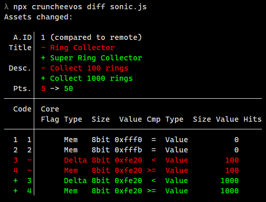

# cruncheevos

**cruncheevos** are set of tools to deal with [RetroAchievements](https://retroachievements.org/) achievement sets using JavaScript:

* [@cruncheevos/core](./packages/core) - parse condition strings for achievements and leaderboards, asset strings produced by [RAIntegration](https://github.com/RetroAchievements/RAIntegration/) into JavaScript objects and other way around.
  * [API](./packages/core/api-core.md) - mirrors jsdoc comments
  * [define function](./packages/core/define.md)
* [@cruncheevos/cli](./packages/cli) - primarily an alternative to [RATools](https://github.com/Jamiras/RATools). Code achievement sets using JavaScript and use the CLI to update the assets for [RAIntegration](https://github.com/RetroAchievements/RAIntegration/)

Follow individual package README for additional documentation and usage examples

Using these packages assumes familiarity with [RetroAchievements workflow](https://docs.retroachievements.org/Developer-Docs/)

## Small demo

```js
// sonic.js

import { AchievementSet, define as $ } from '@cruncheevos/core'
const set = new AchievementSet({ gameId: 1, title: 'Sonic the Hedgehog' })

function gotRings(amount) {
  return $(
    ['', 'Mem', '8bit', 0xfff0, '=', 'Value', '', 0],
    ['', 'Mem', '8bit', 0xfffb, '=', 'Value', '', 0],
    ['', 'Delta', '8bit', 0xfe20, '<', 'Value', '', amount],
    ['', 'Mem', '8bit', 0xfe20, '>=', 'Value', '', amount],
  )
}

set.addAchievement({
  title: 'Super Ring Collector',
  description: 'Collect 1000 rings',
  points: 50,
  conditions: $(
    gotRings(1000)
  ),
  badge: '250341',
  id: 1,
})

export default set
```



## Achievement set examples

* [suXinjke/RAScripts](https://github.com/suXinjke/RAScripts)
* .. your repository here? ..

## Contributing

* You're welcome to [report issues](https://github.com/suXinjke/cruncheevos/issues)
  * Using the CLI? Include information about your OS and node.js version in that case (or the fact you tried to use bun)
* You're welcome to [request features](https://github.com/suXinjke/cruncheevos/issues)
  * When doing so, please show how you would use the feature and what problem of yours it solves
  * The [core library](./packages/core) should stay minimal and zero-dependency. If you want something there - it has to be universally helpful for all library users. If many users implement same feature on their own - the feature might be considered for core library.
* Restrain from making code-related Pull Requests until the core library hits 1.0.0 version, just report an issue or feature request instead
* Documentation-related Pull Requests are welcome (including jsdoc edits in the code)